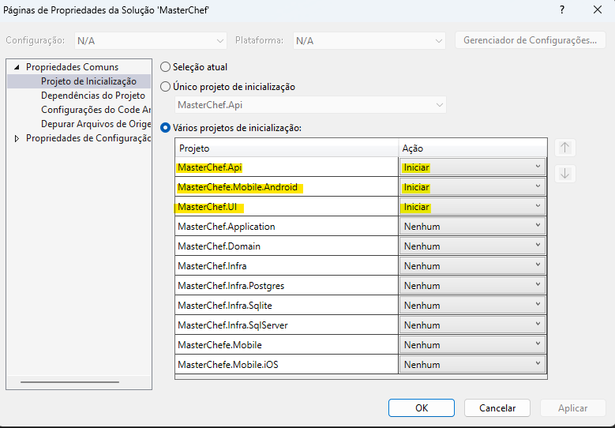
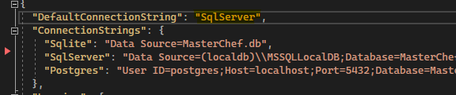
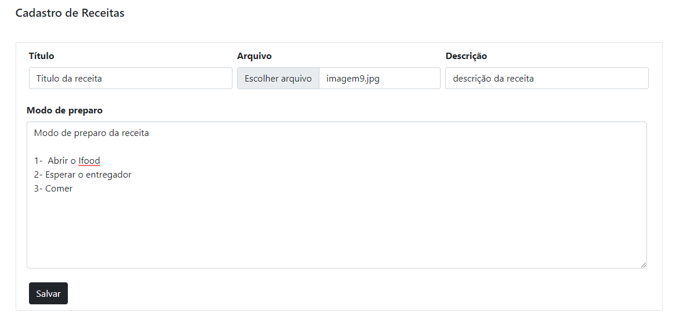
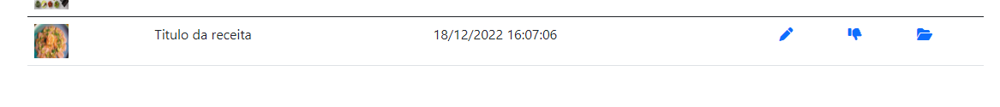
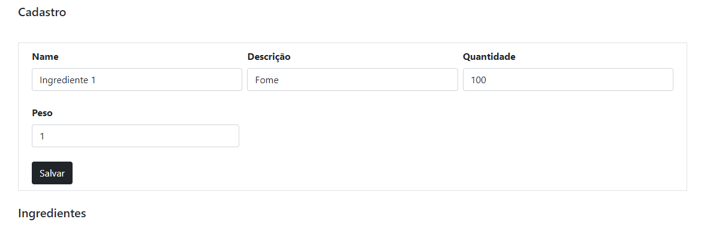
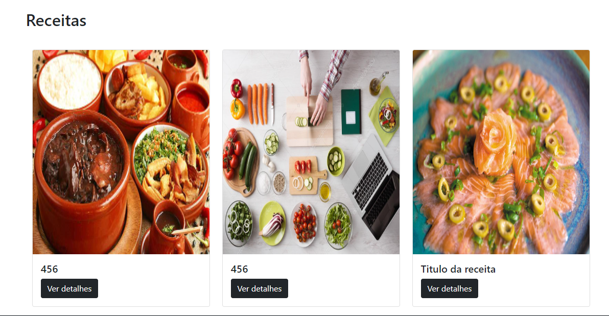
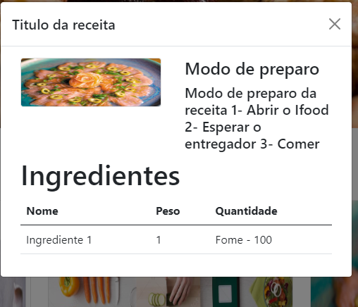

# Projeto MasterChef

## Projeto de final do curso de desenvolvimento WEB do MBA FIAP

&nbsp;
## Inicialização do projeto:

&nbsp;

Para iniciar o projeto, ir em **solução**, **propriedades** e ativar ***"Varios Projetos de inicialização"***

- Selecionar "MasterChef.Api" e "MasterChef.UI"

---
Definir o banco usado para inicialização do projeto:

  - No projeto ***MasterChef.Api***, podemos trocar o Banco usado. Para isso, devemos ir em **appsettings.json**, localizar o campo **DefaultConnectionString**, que define o banco a ser utilizado (Por default está como SqlServer, mas pode ser trocado para qualquer dos bancos que tem connectionString).

&nbsp;

> O banco será gerado automaticamente assim que o projeto ser inicializado, não necessitando assim efetuar o comando *update-database*.

&nbsp;

---
## Exemplo do cadastro de uma receita:
&nbsp;

1. Efetuar o registro / login no sistema;

2. Depois de logado, clicar em **Cadastro de receitas** na parte superior do site;

3. Preencher o cadastro de receitas conforme o exemplo:

4. Após salvar a receita, clicar no ultimo ícone da lista para cadastrar os ingredientes da mesma:

5. Na tela a seguir, adicioar todos os ingredientes, salvando 1 a 1:

6. Após isso, as receitas irão aparecer na tela inicial:

7. Ao clicar em "Ver detalhes", serão apresentados os detalhes da receita conforme cadastro:

