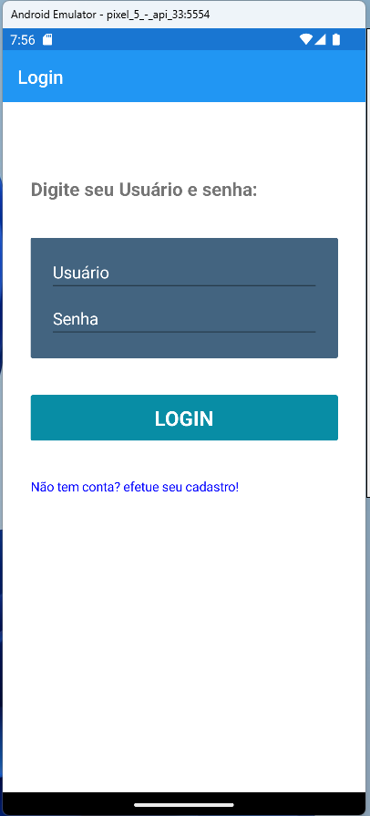
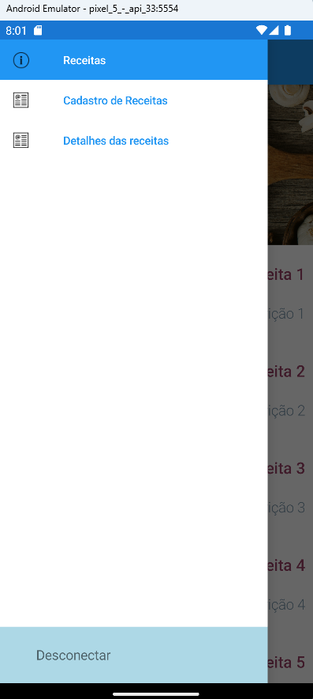
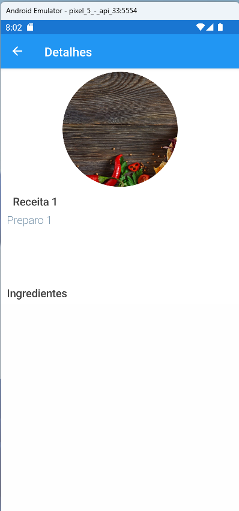

# Projeto MasterChef

## Projeto de final do curso de desenvolvimento Xamarin do MBA FIAP

&nbsp;

O Projeto engloba um site e um aplicativo multiplataforma, ambos consumindo a mesma api para o controle de receitas. Podemos efetuar a visualização, adição ou deleção de receitas ou ingredientes tanto no site quanto no aplicativo.

&nbsp;
## Inicialização apenas do projeto Mobile:

&nbsp;

Para iniciar o projeto, ir em **solução**, **propriedades** e ativar ***"Varios Projetos de inicialização"***

- Selecionar "MasterChefe.Api" e "MasterChefe.Mobile.Android"

---
Definir o banco usado para inicialização do projeto:

  - No projeto ***MasterChefe.Api***, podemos trocar o Banco usado. Para isso, devemos ir em **appsettings.json**, localizar o campo **DefaultConnectionString**, que define o banco a ser utilizado (Por default está como SqlServer, mas pode ser trocado para qualquer dos bancos que tem connectionString).

&nbsp;

> O banco será gerado automaticamente assim que o projeto ser inicializado, não necessitando assim efetuar o comando *update-database*.

&nbsp;

---
## Exemplo de uso do app Android:
&nbsp;

- Efetuar o registro / login no sistema;
(Caso não possua Login, ir em *"não tem conta? efetue seu cadastro"*)

- Depois de logado, pode-se usar o menu lateral a qualquer momento para selecionar a visualização / cadastro de receitas

- No App, podemos ver a listagem de receitas

- Ao clicar em uma receita, podemos ver os detalhes da mesma.

- Para editar uma receita, devemos ir no menu lateral em **detalhes da receita**, e depois selecionar a receita que gostaríamos de editar. (nesta tela podemos também excluir a receita ou adicionar ingredientes para a mesma)

- Caso queira se desconectar de sua conta de usuário, na parte inferior do menu existe o botão *"Desconectar"*, que ao ser pressionado fará o logoff do usuário, voltando o sistema para a página inicial.

&nbsp;
## Inicialização do projeto Multiplataforma (WEB/Mobile):

> Caso queira, pode-se também efetuar o cadastro e deleção de receitas pelo site web, para isso ocorrer, siga os passos a seguir.

&nbsp;

Para iniciar o projeto, ir em **solução**, **propriedades** e ativar ***"Varios Projetos de inicialização"***

- Selecionar "MasterChefe.Api", "MasterChefe.UI" e "MasterChefe.Mobile.Android"

&nbsp;

---
## Exemplo do cadastro de uma receita no site WEB:
&nbsp;

1. Efetuar o registro / login no sistema;

2. Depois de logado, clicar em **Cadastro de receitas** na parte superior do site;

3. Preencher o cadastro de receitas conforme o exemplo:

4. Após salvar a receita, clicar no ultimo ícone da lista para cadastrar os ingredientes da mesma:

5. Na tela a seguir, adicionar todos os ingredientes, salvando 1 a 1:

6. Após isso, as receitas irão aparecer na tela inicial:

7. Ao clicar em "Ver detalhes", serão apresentados os detalhes da receita conforme cadastro:

